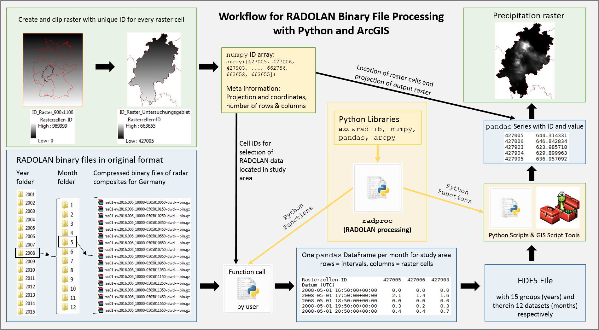

.. _ref-getting-started:

=================
 Getting Started
=================

.. _ref-requirements:

System requirements
~~~~~~~~~~~~~~~~~~~

To be able to use all features offered by radproc, you need...

* a 64-Bit operating system (32-Bit systems can not allocate more than 3 GB memory, which is not sufficient for weather radar data processing)
* Python version 2.7 (64-Bit). It is strongly recommended to use the Anaconda distribution since this already includes all needed scientific site-packages.
* ArcMap version 10.4 or newer
* ArcGIS 64-Bit background processing
* for processing of RADOLAN/RADKLIM data in 5-minute resolution at least 16 GB RAM are recommended

.. _ref-installation:

Installation
~~~~~~~~~~~~
First, install ArcMap for Desktop and its extension 64-Bit background processing.

Next, download and install the latest Anaconda distribution from https://www.anaconda.com/download/ (Windows, 64-Bit, Python version 2.7).

All radproc versions are hosted at the Python Package Index (PyPI). Thus, they can be directly downloaded and installed using pip.

To install radproc using Anaconda and pip...

1. Open the Windows terminal by typing CMD into the Windows search (Administrator rights may be necessary!).
2. Type::

	pip install radproc
	
   Now radproc is automatically downloaded from PyPI and installed into your Anaconda root environment.
   You can check by opening Spyder or Jupyter Notebook and entering::

	import radproc
	
   Alternative installation procedure:
   
   radproc is also available as wheel file for Python version 2.7 on Windows operating systems (64-Bit only!).
   You can download the radproc wheel (radproc-0.1.x-py2-none-any.whl) of any version from the GitHub repository at https://github.com/jkreklow/radproc/tree/0.1.3/dist
   To install the wheel file type::
	
	pip install C:\path\to\wheelfile\radproc_wheel.whl
	

To enable your Anaconda distribution to "see" the arcpy package from your separate ArcGIS Python installation,
you need to **copy the Path file DTBGGP64.pth** which is usually located at *C:\\Python27\\ArcGISx6410.4\\Lib\\site-packages*
into the corresponding site-packages folder of your Anaconda distribution, e.g. *C:\\ProgramData\\Anaconda2\\Lib\\site-packages*

To check if arcpy is now visible for Anaconda, import arcpy to Spyder or Jupyter Notebook::

	import arcpy

.. _ref-filesystem:

File system description
~~~~~~~~~~~~~~~~~~~~~~~

	
File system and processing workflow used by radproc.

.. _ref-gettingdata:

Getting data
~~~~~~~~~~~~
RADOLAN is a weather radar product intended for operational applications in precipitation monitoring and nowcasting, water management, flood protection etc.
with the composite being provided about 20 minutes after the end of the respective measurement interval.

RADKLIM is a reanalysis of all available weather radar data in Germany back to the year 2001 and primarily intended for climatological applications and heavy rainfall analysis.
It is based on the RADOLAN software but more rain gauges are used for adjustment and more correction algorithms are applied homogeneously on the entire time series.

	- RADOLAN RW composites (900*900 1*1 km pixels, hourly resolution, since 05.2006) are available at ftp://ftp-cdc.dwd.de/pub/CDC/grids_germany/hourly/radolan/
	- RADKLIM RW (1100*900 1*1 km pixels, hourly resolution, 2001 - 2017, DOI: 10.5676/DWD/RADKLIM_RW_V2017.002) and
	- RADKLIM YW (1100*900 1*1 km pixels, 5 minute resolution, 2001 - 2017, DOI: 10.5676/DWD/RADKLIM_YW_V2017.002) are available at ftp://ftp-anon.dwd.de/pub/data/gpcc/radarklimatologie/doi_landingpage_2017.002.html

