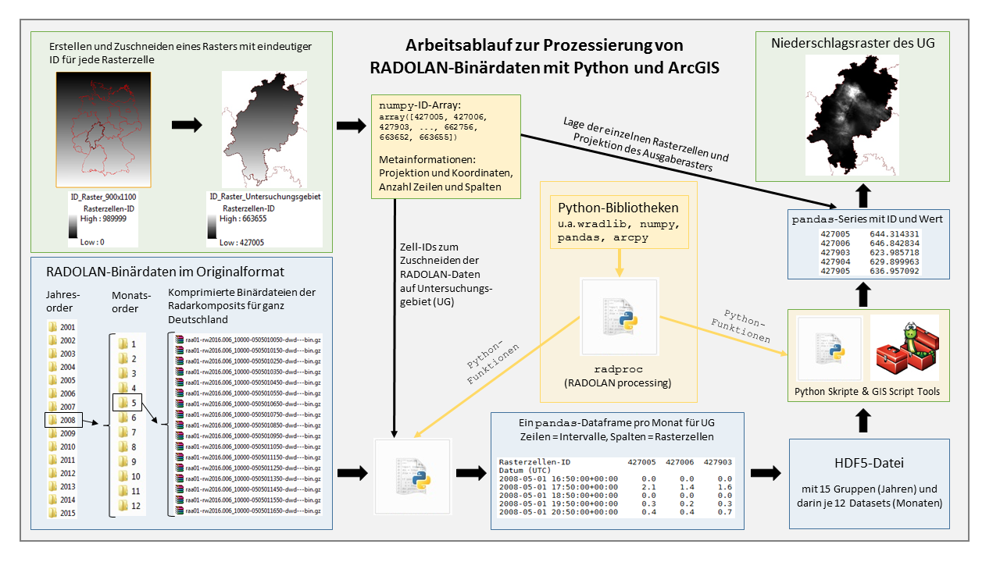

Getting Started
===============

.. _ref-requirements:
System requirements
~~~~~~~~~~~~~~~~~~~

To be able to use all features offered by radproc, you need...

* a 64-Bit operating system (32-Bit systems can not allocate more than 3 GB memory, which is not sufficient for radar data processing)
* Python version 2.7 (64-Bit). It is strongly recommended to use the Anaconda distribution since this already includes all needed scientific site-packages.
* ArcMap version 10.4 or newer
* ArcGIS 64-Bit background processing
* for processing of RADOLAN data in 5-minute resolution at least 16 GB RAM are recommended

.. _ref-installation:
Installation
~~~~~~~~~~~~
radproc is distributed as wheel file for Python version 2.7 on Windows operating systems (64-Bit only!).

To install radproc using Anaconda and pip...

1. Open the Windows terminal by typing CMD into the Windows search (Administrator rights may be necessary!).
2. Type::

	pip install C:\path\to\wheelfile\radproc_wheel.whl

   Now radproc is automatically installed into your Anaconda root environment.
   You can check by opening Spyder or Jupyter Notebook and entering::

	import radproc
	
3. To enable your Anaconda distribution to "see" the arcpy package from your separate ArcGIS Python installation,
   you need to **copy the Path file DTBGGP64.pth** which is usually located at *C:\\Python27\\ArcGISx6410.4\\Lib\\site-packages*
   into the corresponding site-packages folder of your Anaconda distribution, e.g. *C:\\ProgramData\\Anaconda2\\Lib\\site-packages*

   To check if arcpy is now visible for Anaconda, import arcpy to Spyder or Jupyter Notebook::

	import arcpy

.. _ref-filesystem:
File system description
~~~~~~~~~~~~~~~~~~~~~~~

	
File system and processing workflow used by radproc.